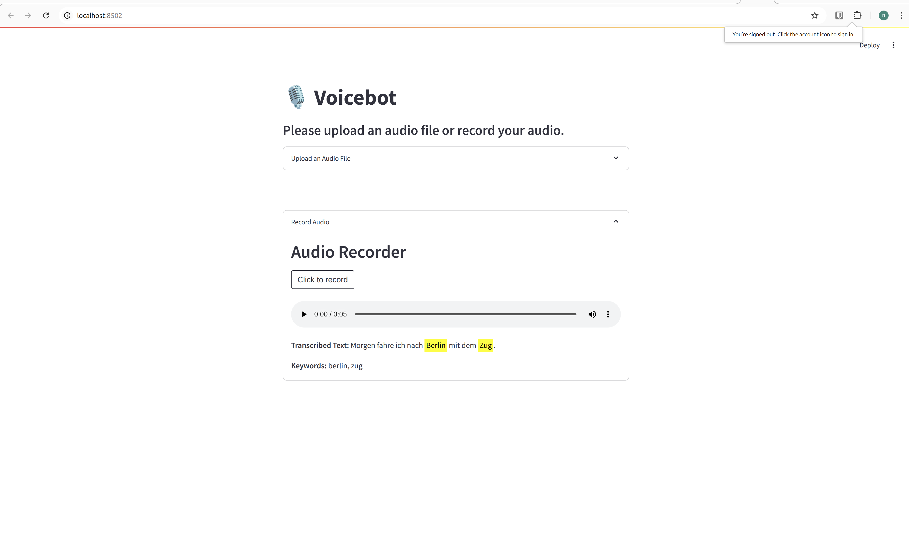

# voice keyword detector

Lightweight speech-to-text + keyword extraction service with a FastAPI backend and Streamlit UI.

## Architecture

- **Backend (FastAPI):** Handles audio upload, speech-to-text transcription, and keyword detection.
- **Frontend (Streamlit):** Provides a simple UI for uploading or recording audio and displaying results.
- **Keywords:** Defined in `src/keywords.json` and used to detect and highlight terms in the transcribed text.

## Features
- Upload audio (wav/mp3/ogg) -> automatic conversion -> transcription.
- Keyword detection from configurable list.
- Mockable components for fast tests.

### Installation & Run

1. **Clone the repository:**
   ```bash
   git clone https://github.com/nagajavisetty/voicebot.git
   cd voicebot
   ```

2. **Build and run the containers:**
   ```bash
   docker-compose up --build
   ```

3. **Access the application:**
   - Frontend: [http://localhost:8080](http://localhost:8080)

### Usage

1. **Upload an audio file:**
   - Open the frontend at [http://localhost:8080](http://localhost:8080).
   - Upload an audio file (MP3 or WAV format).
   - The transcribed text and detected keywords will be displayed.

2. **View results:**
   - The transcribed text is shown on the page.
   - Detected keywords are highlighted with colored buttons.

### User Demo UI

- Transcribed Text: Inline highlighted keywords

- Keywords List: Detected keywords in plain text


)

### Configuration

- **keywords.json**: Update this file to modify the list of keywords to be detected. Example format:
  ```json
  {
      "keywords": ["Leipzig", "Zug", "Berlin"]
  }
  ```

### Example

To test the application, you can use any German language audio file. The backend will transcribe the audio and detect the specified keywords, displaying the results on the frontend.

### Troubleshooting

- Ensure Docker and Docker Compose are installed and running correctly.
- Verify that the ports `8000` (backend) and `8080` (frontend) are not being used by other applications.

### License

This project is licensed under the MIT License. See the [LICENSE](LICENSE) file for details.

